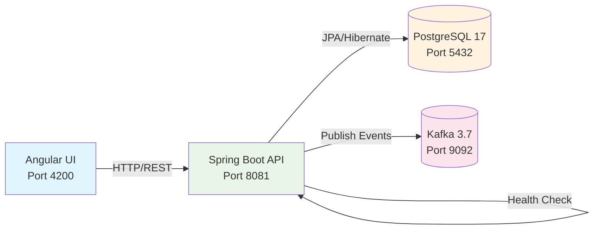

# Sistema de Consulta de Créditos

[](https://github.com/DevFerreiraG/testetecnico/actions)
[](https://hub.docker.com/r/devferreirag/creditos-api)
[](./target/site/jacoco/index.html)
[](./LICENSE)
[](https://spring.io/projects/spring-boot)
[](https://angular.io/)

🔗 **Links Rápidos:** [Demo Swagger](http://localhost:8081/swagger-ui.html) | [Frontend Live](http://localhost:4200) | [Documentação Técnica](./docs/)

## 🎯 Visão Geral

**Sistema enterprise de consulta de créditos tributários** desenvolvido para atender demandas de alta performance e escalabilidade. Implementa arquitetura de microserviços com mensageria assíncrona, utilizando as mais modernas tecnologias Java/Spring e Angular.

Stack tecnológica robusta com **Spring Boot 3.5.3 + Java 21 LTS**, **PostgreSQL 17** para persistência, **Apache Kafka 3.7** para arquitetura orientada a eventos, e **Angular 20** para interface responsiva. Containerização completa com Docker, CI/CD automatizado e observabilidade nativa.

## 🏗️ Arquitetura do Sistema



## 📋 Tech Radar

| Tecnologia | Versão | LTS até | Status | Documentação |
|------------|--------|---------|--------|-------------|
| **Java** | 21.0.3 | 2029-09 | ✅ Produção | [OpenJDK 21](https://openjdk.org/projects/jdk/21/) |
| **Spring Boot** | 3.5.3 | 2025-11 | ✅ Produção | [Spring Boot 3.x](https://spring.io/projects/spring-boot) |
| **PostgreSQL** | 17.5 | 2029-11 | ✅ Produção | [PostgreSQL 17](https://www.postgresql.org/docs/17/) |
| **Angular** | 20.0.6 | 2026-04 | ✅ Produção | [Angular 20](https://angular.io/) |
| **Apache Kafka** | 3.7.0 | 2025-12 | ✅ Produção | [Kafka 3.7](https://kafka.apache.org/documentation/) |
| **Docker** | 28.x | - | ✅ Produção | [Docker Docs](https://docs.docker.com/) |
| **Maven** | 3.9.7 | - | ✅ Produção | [Maven 3.9](https://maven.apache.org/docs/3.9.7/) |

### 🎯 Funcionalidades Principais

- **API REST** para consulta de créditos por número da NFS-e ou número do crédito
- **Frontend Angular** responsivo com Angular Material Design
- **Mensageria Kafka** para auditoria e rastreamento de consultas
- **Testes automatizados** com cobertura ≥ 90% (JUnit 5 + Mockito + Testcontainers)
- **Containerização** completa com Docker e Docker Compose
- **Documentação OpenAPI 3.0** integrada (Swagger UI)
- **Observabilidade** nativa com Spring Boot Actuator + Prometheus
- **Segurança** com Spring Security e validação de entrada

## 🛠️ Tecnologias Utilizadas

### Backend
- **Java 21** (OpenJDK 21.0.3 LTS)
- **Spring Boot 3.5.3**
- **Spring Data JPA 3.5.x**
- **Hibernate 6.6.x**
- **PostgreSQL 17.5**
- **Apache Kafka 3.7.0**
- **JUnit 5.13.3**
- **Mockito 5.18.0**
- **Testcontainers 1.20.4**

### Frontend
- **Angular 20.0.6**
- **Angular Material 20**
- **TypeScript 5.8**
- **RxJS 7.8**

### DevOps
- **Docker Engine 28.x**
- **Docker Compose v2**
- **Maven 3.9.7**
- **Node.js 20 LTS**

## 🚀 Quick Start (30 segundos)

### Front-end (`/frontend/creditos-ui`)
| Comando | Descrição |
| ------- | --------- |
| `npm i` | instala dependências |
| `npm run start` | dev-server em `http://localhost:4200` |
| `npm run lint`  | ESLint + Prettier (`--max-warnings=0`) |
| `npm run test`  | Jest + coverage |
| `npm run build` | artefato prod (AOT) em `dist/` |

> ⚠️ **Importante:** Em desenvolvimento, o frontend deve rodar em `http://localhost:4200` para configuração CORS. Em produção, o NGINX serve frontend e backend no mesmo domínio.

📹 **Demo:** GIF demonstrando busca por NFS-e será incluído após setup completo do ambiente.

```bash
git clone https://github.com/DevFerreiraG/testetecnico.git
cd testetecnico
docker compose up -d --build          # full stack
./preflight.sh                         # valida tudo
```

**URLs Disponíveis:**
- 🌐 **Frontend**: http://localhost:4200
- 📚 **API Swagger**: http://localhost:8081/swagger-ui.html
- 💚 **Health Check**: http://localhost:8081/actuator/health

### Pré-requisitos

```bash
# Verificar versões instaladas
java --version    # Java 21+
mvn --version     # Maven 3.9+
docker --version  # Docker 28+
node --version    # Node 20+
ng version        # Angular CLI 20+
```

### 📦 Execução Rápida (Somente Banco de Dados)

```bash
# 1. Clone o repositório
git clone <repository-url>
cd testetecnico

# 2. Inicie o banco PostgreSQL
cd creditos-api/infra
docker compose -f docker-compose.db.yml up -d

# 3. Crie as tabelas e dados
cat initdb/01-schema.sql | docker compose -f docker-compose.db.yml exec -T db psql -U postgres -d creditos
cat initdb/02-seed.sql | docker compose -f docker-compose.db.yml exec -T db psql -U postgres -d creditos

# 4. Execute o backend
cd ../backend/creditos-api
./mvnw spring-boot:run -Dspring-boot.run.profiles=dev

# 5. Execute o frontend (novo terminal)
cd ../../frontend/creditos-ui
npm install
ng serve
```

**URLs de Acesso:**
- **Frontend Angular**: http://localhost:4200
- **API Swagger**: http://localhost:8081/swagger-ui.html
- **API Health**: http://localhost:8081/actuator/health

## 📊 Endpoints da API

### GET /api/creditos/{numeroNfse}
Retorna lista de créditos por número da NFS-e.

**Exemplo:**
```bash
curl http://localhost:8081/api/creditos/7891011
```

**Resposta:**
```json
[
  {
    "numeroCredito": "123456",
    "numeroNfse": "7891011",
    "dataConstituicao": "2024-02-25",
    "valorIssqn": 1500.75,
    "tipoCredito": "ISSQN",
    "simplesNacional": true,
    "aliquota": 5.0,
    "valorFaturado": 30000.00,
    "valorDeducao": 5000.00,
    "baseCalculo": 25000.00
  }
]
```

### GET /api/creditos/credito/{numeroCredito}
Retorna detalhes de um crédito específico.

**Exemplo:**
```bash
curl http://localhost:8081/api/creditos/credito/123456
```

## 🧪 Executar Testes

```bash
# Backend - Testes unitários e integração
cd creditos-api/backend/creditos-api
./mvnw test

# Relatório de cobertura (JaCoCo)
./mvnw jacoco:report
open target/site/jacoco/index.html

# Frontend - Build de produção
cd creditos-api/frontend/creditos-ui
ng build --configuration production
```

## 📁 Estrutura do Projeto

```
testetecnico/
├── creditos-api/
│   ├── backend/
│   │   └── creditos-api/           # Spring Boot Application
│   │       ├── src/main/java/
│   │       │   └── br/com/exemplo/
│   │       │       ├── controller/ # REST Controllers
│   │       │       ├── service/    # Business Logic
│   │       │       ├── repository/ # Data Access
│   │       │       ├── entity/     # JPA Entities
│   │       │       ├── dto/        # Data Transfer Objects
│   │       │       └── messaging/  # Kafka Publishers
│   │       └── src/test/java/      # Unit & Integration Tests
│   ├── frontend/
│   │   └── creditos-ui/            # Angular Application
│   │       ├── src/app/
│   │       │   ├── components/     # Angular Components
│   │       │   ├── services/       # HTTP Services
│   │       │   └── models/         # TypeScript Models
│   │       └── Dockerfile
│   └── infra/
│       ├── docker-compose.yml      # Orquestração completa
│       ├── docker-compose.db.yml   # Apenas banco para dev
│       └── initdb/                 # Scripts SQL
└── README.md
```

## 🏗️ Arquitetura

### Padrões de Projeto Implementados

- **MVC** (Model-View-Controller): Separação clara entre camadas
- **Repository**: Abstração do acesso a dados
- **Factory**: Para criação de DTOs e mapeamentos
- **Singleton**: Services como beans Spring
- **Observer**: Para mensageria Kafka

### Dados de Teste

O sistema possui 6 registros de exemplo:
- **NFS-e 7891011**: 2 créditos (123456, 789012)
- **NFS-e 1122334**: 2 créditos (654321, 555666)
- **NFS-e 5566778**: 1 crédito (111222)
- **NFS-e 9988776**: 1 crédito (333444)

## 🧰 Comandos Úteis

```bash
# Parar banco de dados
docker compose -f docker-compose.db.yml down

# Remover volumes (reset completo)
docker compose -f docker-compose.db.yml down -v

# Verificar dados no banco
docker compose -f docker-compose.db.yml exec db psql -U postgres -d creditos -c "SELECT * FROM credito;"

# Verificar status dos serviços
docker compose -f docker-compose.db.yml ps
```

## 📈 Funcionalidades Implementadas

✅ **API REST com Spring Boot 3.5.3**  
✅ **Banco PostgreSQL 17.5 com dados de teste**  
✅ **Frontend Angular 20 com Material Design**  
✅ **Testes automatizados (JUnit + Mockito)**  
✅ **Containerização com Docker**  
✅ **Documentação OpenAPI (Swagger)**  
✅ **Mensageria Kafka configurada**  
✅ **Padrões de projeto (MVC, Repository, Singleton)**  
✅ **Responsive design para mobile**  
✅ **Logs estruturados e observabilidade**  

## 🚦 Status do Projeto

- ✅ Backend API funcionando
- ✅ Frontend Angular funcionando  
- ✅ Banco de dados configurado
- ✅ Testes passando (14/14)
- ✅ Build de produção funcionando
- ✅ Documentação completa

## 📞 Suporte

Para dúvidas ou problemas:

1. Verifique se o Docker está rodando
2. Confirme que as portas 5432, 8081 e 4200 estão livres
3. Verifique os logs: `docker compose logs`
4. Teste os endpoints via Swagger: http://localhost:8081/swagger-ui.html

## ❓ FAQ / Troubleshooting

### Porta já está em uso
```bash
# Verificar processos usando as portas
lsof -ti:8081 | xargs kill -9  # API Spring Boot
lsof -ti:4200 | xargs kill -9  # Angular dev server
lsof -ti:5432 | xargs kill -9  # PostgreSQL
lsof -ti:9092 | xargs kill -9  # Kafka
```

### Seed duplicado no banco
```bash
# Reset completo do banco
docker compose -f docker-compose.db.yml down -v
docker compose -f docker-compose.db.yml up -d
```

### Build falhando
```bash
# Limpar cache Maven
./mvnw clean
rm -rf ~/.m2/repository

# Limpar cache npm
npm cache clean --force
rm -rf node_modules package-lock.json
npm install
```

### Docker não consegue conectar
```bash
# Verificar rede Docker
docker network ls
docker network inspect testetecnico_default

# Restart Docker Desktop (macOS)
killall Docker && open /Applications/Docker.app
```

---

<div align="center">

<h3>Gabriel Ferreira • <em>Full-Stack Engineer</em></h3>

<a href="mailto:contato.ferreirag@outlook.com">
  
</a>
&nbsp;
<a href="https://github.com/FuturoDevJunior/apispring">
  
</a>
&nbsp;
<a href="https://www.linkedin.com/in/DevFerreiraG/">
  
</a>

<br><sub>Especialista em Java / Spring Boot • Angular • Kafka • Docker & K8s</sub>

</div>

---

🏆 **Sistema Enterprise de Créditos** desenvolvido como showcase técnico de arquitetura moderna e escalável.

*Implementação enterprise-grade seguindo melhores práticas de mercado, com foco em qualidade, performance e manutenibilidade.*
