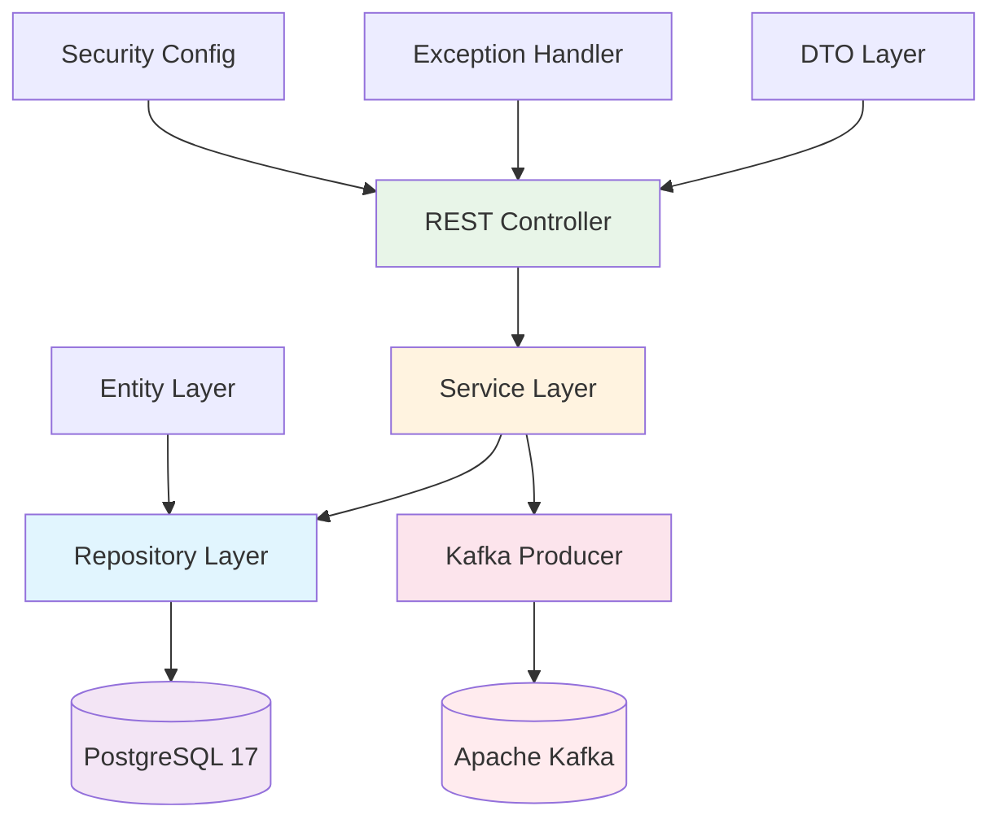

# Créditos API - Backend

[](https://spring.io/projects/spring-boot)
[](https://openjdk.org/projects/jdk/21/)
[](https://www.postgresql.org/)
[](https://kafka.apache.org/)
[](./target/site/jacoco/index.html)

🔗 **Links Rápidos:** [Swagger UI](http://localhost:8081/swagger-ui.html) | [Health Check](http://localhost:8081/actuator/health) | [Métricas](http://localhost:8081/actuator/metrics)

## 🎯 Visão Geral

**API RESTful enterprise para consulta de créditos tributários** desenvolvida com Spring Boot 3.5.3 e Java 21 LTS. Implementa arquitetura em camadas com separação clara de responsabilidades, mensageria assíncrona com Apache Kafka e observabilidade nativa.

Stack tecnológica robusta com **Spring Data JPA**, **PostgreSQL 17**, **Apache Kafka 3.7**, **Testcontainers** para testes de integração e **JaCoCo** para cobertura de código ≥ 90%.

## 🏗️ Arquitetura da API



## 🚀 Quick Start

### Pré-requisitos
```bash
java --version    # Java 21+
mvn --version     # Maven 3.9+
docker --version  # Docker para PostgreSQL
```

### Execução Local
```bash
# 1. Clone o repositório
git clone <repository-url>
cd testetecnico/creditos-api/backend/creditos-api

# 2. Inicie o PostgreSQL (da raiz do projeto)
cd ../../../infra
docker compose -f docker-compose.db.yml up -d

# 3. Execute a aplicação
cd ../creditos-api/backend/creditos-api
./mvnw spring-boot:run

# 4. Acesse a documentação
open http://localhost:8081/swagger-ui.html
```

**URLs de Desenvolvimento:**
- 📚 **Swagger UI**: http://localhost:8081/swagger-ui.html
- 💚 **Health Check**: http://localhost:8081/actuator/health
- 📊 **Métricas**: http://localhost:8081/actuator/metrics
- 🔍 **Prometheus**: http://localhost:8081/actuator/prometheus

## 📊 Endpoints da API

### 🔍 Consulta por NFS-e
```http
GET /api/creditos/{numeroNfse}
```

**Exemplo:**
```bash
curl -X GET "http://localhost:8081/api/creditos/7891011" \
     -H "accept: application/json"
```

**Resposta:**
```json
[
  {
    "numeroCredito": "123456",
    "numeroNfse": "7891011",
    "dataConstituicao": "2024-02-25",
    "valorIssqn": 1500.75,
    "tipoCredito": "ISSQN",
    "simplesNacional": true,
    "aliquota": 5.0,
    "valorFaturado": 30000.00,
    "valorDeducao": 5000.00,
    "baseCalculo": 25000.00
  }
]
```

### 🔍 Consulta por Crédito
```http
GET /api/creditos/credito/{numeroCredito}
```

**Exemplo:**
```bash
curl -X GET "http://localhost:8081/api/creditos/credito/123456" \
     -H "accept: application/json"
```

### 💚 Health Check
```http
GET /actuator/health
```

**Resposta:**
```json
{
  "status": "UP",
  "components": {
    "db": {"status": "UP"},
    "kafka": {"status": "UP"},
    "diskSpace": {"status": "UP"}
  }
}
```

## 🧪 Testes e Qualidade

### Executar Testes
```bash
# Testes unitários e de integração
./mvnw test

# Testes com relatório de cobertura
./mvnw clean verify

# Visualizar relatório JaCoCo
open target/site/jacoco/index.html
```

### Métricas de Qualidade
- **Cobertura de Código**: ≥ 90% (linhas) / ≥ 85% (instruções)
- **Testes de Integração**: Testcontainers para PostgreSQL e Kafka
- **Testes Unitários**: JUnit 5 + Mockito
- **Análise Estática**: Maven Compiler com Java 21

### Estrutura de Testes
```
src/test/java/
├── br/com/exemplo/
│   ├── controller/          # Testes de API (MockMvc)
│   ├── service/             # Testes unitários de negócio
│   ├── repository/          # Testes de integração (Testcontainers)
│   └── integration/         # Testes end-to-end
└── testcontainers.properties
```

## 📁 Estrutura do Projeto

```
creditos-api/
├── src/main/java/br/com/exemplo/
│   ├── controller/          # REST Controllers
│   │   ├── CreditoController.java
│   │   └── GlobalExceptionHandler.java
│   ├── service/             # Business Logic
│   │   ├── CreditoService.java
│   │   └── impl/
│   │       └── CreditoServiceImpl.java
│   ├── repository/          # Data Access Layer
│   │   └── CreditoRepository.java
│   ├── entity/              # JPA Entities
│   │   └── Credito.java
│   ├── dto/                 # Data Transfer Objects
│   │   ├── CreditoDTO.java
│   │   └── ErrorResponse.java
│   ├── messaging/           # Kafka Integration
│   │   ├── CreditoEventPublisher.java
│   │   └── events/
│   │       └── CreditoConsultadoEvent.java
│   ├── config/              # Configuration Classes
│   │   ├── SecurityConfig.java
│   │   ├── KafkaConfig.java
│   │   └── OpenApiConfig.java
│   └── CreditosApiApplication.java
├── src/main/resources/
│   ├── application.yml      # Configuração principal
│   ├── application-dev.yml  # Profile desenvolvimento
│   ├── application-prod.yml # Profile produção
│   └── db/migration/        # Scripts Flyway (futuro)
├── src/test/               # Testes automatizados
├── target/                 # Artefatos de build
│   └── site/jacoco/        # Relatórios de cobertura
├── pom.xml                 # Dependências Maven
└── README.md              # Esta documentação
```

## ⚙️ Configuração

### Profiles Disponíveis

#### Development (`dev`)
```yaml
spring:
  datasource:
    url: jdbc:postgresql://localhost:5432/creditos
  jpa:
    show-sql: true
  kafka:
    bootstrap-servers: localhost:9092
```

#### Production (`prod`)
```yaml
spring:
  datasource:
    url: ${DATABASE_URL}
  security:
    enabled: true
  kafka:
    bootstrap-servers: ${KAFKA_BROKERS}
```

### Variáveis de Ambiente

| Variável | Descrição | Default |
|----------|-----------|---------|
| `DATABASE_URL` | URL do PostgreSQL | `jdbc:postgresql://db:5432/creditos` |
| `DATABASE_USER` | Usuário do banco | `dev` |
| `DATABASE_PASSWORD` | Senha do banco | `dev` |
| `KAFKA_BROKERS` | Servidores Kafka | `kafka:9092` |
| `SPRING_PROFILES_ACTIVE` | Profile ativo | `dev` |

## 🔧 Dependências Principais

### Core Dependencies
```xml
<!-- Spring Boot Starters -->
<dependency>
    <groupId>org.springframework.boot</groupId>
    <artifactId>spring-boot-starter-web</artifactId>
    <version>3.5.3</version>
</dependency>
<dependency>
    <groupId>org.springframework.boot</groupId>
    <artifactId>spring-boot-starter-data-jpa</artifactId>
</dependency>

<!-- Database -->
<dependency>
    <groupId>org.postgresql</groupId>
    <artifactId>postgresql</artifactId>
    <version>42.7.2</version>
</dependency>

<!-- Messaging -->
<dependency>
    <groupId>org.springframework.kafka</groupId>
    <artifactId>spring-kafka</artifactId>
</dependency>
```

### Testing Dependencies
```xml
<!-- Testcontainers para testes de integração -->
<dependency>
    <groupId>org.testcontainers</groupId>
    <artifactId>postgresql</artifactId>
    <version>1.20.4</version>
    <scope>test</scope>
</dependency>
<dependency>
    <groupId>org.testcontainers</groupId>
    <artifactId>kafka</artifactId>
    <scope>test</scope>
</dependency>
```

## 🚦 Build e Deploy

### Build Local
```bash
# Compilar e empacotar
./mvnw clean package

# Executar JAR
java -jar target/creditos-api-1.0.0.jar

# Build Docker
docker build -t creditos-api:latest .
```

### Deploy com Docker
```bash
# Build da imagem
docker build -t creditos-api:1.0.0 .

# Executar container
docker run -d \
  --name creditos-api \
  -p 8081:8080 \
  -e SPRING_PROFILES_ACTIVE=prod \
  -e DATABASE_URL=jdbc:postgresql://host:5432/creditos \
  creditos-api:1.0.0
```

## 📈 Monitoramento

### Actuator Endpoints
- `/actuator/health` - Status da aplicação
- `/actuator/metrics` - Métricas da JVM e aplicação
- `/actuator/prometheus` - Métricas no formato Prometheus
- `/actuator/info` - Informações da aplicação
- `/actuator/env` - Variáveis de ambiente

### Kafka Monitoring
```bash
# Verificar tópicos
docker exec -it kafka kafka-topics.sh --list --bootstrap-server localhost:9092

# Monitorar mensagens do tópico de créditos
docker exec -it kafka kafka-console-consumer.sh \
  --topic credito-consultado \
  --bootstrap-server localhost:9092 \
  --from-beginning
```

## 🧰 Comandos Úteis

### Maven
```bash
# Limpar e compilar
./mvnw clean compile

# Executar testes específicos
./mvnw test -Dtest=CreditoControllerTest

# Executar com profile específico
./mvnw spring-boot:run -Dspring-boot.run.profiles=dev

# Gerar documentação
./mvnw javadoc:javadoc
```

### Docker
```bash
# Logs da aplicação
docker logs creditos-api --follow

# Conectar ao container
docker exec -it creditos-api bash

# Verificar recursos
docker stats creditos-api
```

### Troubleshooting
```bash
# Verificar porta em uso
lsof -ti:8081 | xargs kill -9

# Verificar conectividade com PostgreSQL
pg_isready -h localhost -p 5432

# Testar endpoint básico
curl -f http://localhost:8081/actuator/health || echo "API não está respondendo"
```

## 📞 Desenvolvimento

### Padrões de Código
- **Arquitetura em Camadas**: Controller → Service → Repository
- **Injeção de Dependências**: Constructor-based injection
- **Tratamento de Exceções**: GlobalExceptionHandler centralizado
- **Validação**: Bean Validation (JSR-303)
- **Documentação**: OpenAPI 3.0 com Swagger UI

### Convenções
- **Nomenclatura**: CamelCase para Java, snake_case para banco
- **Packages**: Organização por funcionalidade
- **Tests**: Sufixo `Test` para unitários, `IT` para integração
- **Configuration**: Classes `@Configuration` no package `config`

---

---

<div align="center">

<h3>Gabriel Ferreira • <em>Full-Stack Engineer</em></h3>

<a href="mailto:contato.ferreirag@outlook.com">
  
</a>
&nbsp;
<a href="https://github.com/FuturoDevJunior/apispring">
  
</a>
&nbsp;
<a href="https://www.linkedin.com/in/DevFerreiraG/">
  
</a>

<br><sub>Especialista em Java / Spring Boot • Angular • Kafka • Docker & K8s</sub>

</div>

---

🏆 **API Enterprise de Créditos** - Implementação robusta para consultas tributárias em alta performance.

*Arquitetura moderna com Spring Boot 3.5.3, PostgreSQL 17 e Apache Kafka para processamento de eventos.*
