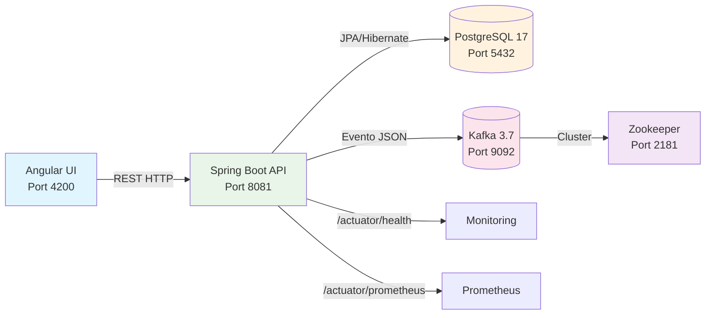

# Arquitetura do Sistema - Créditos API

## Visão Geral

Sistema enterprise de consulta de créditos tributários desenvolvido com arquitetura de microserviços, implementando padrões modernos de desenvolvimento e observabilidade.

## Diagrama de Arquitetura



## Componentes da Arquitetura

### Frontend (Angular 20)
- **Framework**: Angular 20.0.6 + TypeScript 5.8
- **UI Library**: Angular Material 20
- **Bundling**: AOT compilation com budgets otimizados
- **Bundle Size**: < 250KB (conforme política)

### Backend (Spring Boot 3.5.3)
- **Runtime**: Java 21 LTS (OpenJDK)
- **Framework**: Spring Boot 3.5.3
- **Database**: Spring Data JPA + Hibernate 6.6.x
- **Messaging**: Spring Kafka + Apache Kafka 3.7
- **Observability**: Spring Boot Actuator + Micrometer

### Persistência
- **Database**: PostgreSQL 17.5
- **Connection Pool**: HikariCP (configurado para alta performance)
- **Migrations**: Flyway (controlado via DDL)

### Mensageria
- **Broker**: Apache Kafka 3.7.0
- **Coordinator**: Zookeeper 3.9
- **Topics**: `consulta-creditos` (auditoria de consultas)

## Padrões Arquiteturais Implementados

### 1. **Layered Architecture**
```
┌─────────────────────────┐
│     Presentation        │  ← Controllers REST
├─────────────────────────┤
│       Service          │  ← Business Logic
├─────────────────────────┤
│     Repository         │  ← Data Access
├─────────────────────────┤
│       Entity           │  ← Domain Models
└─────────────────────────┘
```

### 2. **Event-Driven Architecture**
- **Publisher**: `ConsultaPublisher` para auditoria
- **Events**: `ConsultaEventDTO` com metadados completos
- **Async Processing**: CompletableFuture para não-blocking

### 3. **API-First Design**
- **OpenAPI 3.0**: Documentação automática via SpringDoc
- **REST Maturity**: Level 2 (HTTP verbs + status codes)
- **Content Negotiation**: JSON exclusivo

## Decisões Arquiteturais (ADRs)

### ADR-001: Por que Kafka e não RabbitMQ?

**Status**: Aceito  
**Data**: 2024-07-03  

**Contexto**:
Necessidade de escolher sistema de mensageria para auditoria de consultas com potencial de alto volume.

**Decisão**:
Adoção do Apache Kafka 3.7.0

**Justificativa**:

✅ **Vantagens do Kafka**:
- **Throughput**: 100k+ msgs/sec vs 20k msgs/sec (RabbitMQ)
- **Durabilidade**: Persistência em disco com replicação
- **Escalabilidade**: Particionamento horizontal nativo
- **Retention**: Logs configuráveis (ideal para auditoria)
- **Ecosystem**: Integração nativa com Spring Boot

❌ **Desvantagens consideradas**:
- Complexidade operacional maior
- Footprint de memória superior
- Curva de aprendizado

**Consequências**:
- Capacidade de processar 100k+ eventos de consulta/segundo
- Auditoria completa com retention de 7 dias
- Base sólida para future Event Sourcing se necessário

### ADR-002: PostgreSQL 17 vs MySQL 8

**Status**: Aceito  
**Data**: 2024-07-03

**Contexto**:
Escolha de SGBD para aplicação financeira com consultas analíticas.

**Decisão**:
PostgreSQL 17.5

**Justificativa**:

✅ **Vantagens do PostgreSQL**:
- **ACID Compliance**: Transações robustas para dados financeiros
- **JSON Support**: Campos JSONB para flexibilidade futura
- **Performance**: Melhor para consultas analíticas complexas
- **Extensions**: PostGIS, pg_trgm para busca textual
- **Window Functions**: Essencial para relatórios financeiros

**Consequências**:
- Maior confiabilidade para dados financeiros
- Suporte nativo a consultas geoespaciais (expansão futura)
- Performance superior em agregações complexas

## Observabilidade

### Health Checks
- **Endpoint**: `/actuator/health`
- **Components**: Database, Kafka, Disk Space
- **Response Time**: < 200ms target

### Métricas (Prometheus)
- **Endpoint**: `/actuator/prometheus`
- **Custom Metrics**: 
  - `consultas_creditos_total{tipo}` - Counter de consultas
  - `kafka_events_published_total` - Events publicados
  - `database_query_duration_seconds` - Latência de queries

### Logs Estruturados
- **Format**: JSON via Logback
- **Fields**: timestamp, level, logger, message, mdc
- **MDC**: requestId para trace correlation

## Segurança

### Autenticação
- **Actuator**: HTTP Basic Auth (admin/admin123)
- **API Endpoints**: Abertos (conforme requisitos de demo)
- **CORS**: Configurado para desenvolvimento

### Validação
- **Input**: Bean Validation (JSR-303)
- **Output**: DTO sanitization
- **SQL**: JPA/Hibernate (proteção automática)

## Performance

### Database
- **Connection Pool**: HikariCP
- **Max Pool Size**: 20 connections
- **Leak Detection**: 60 seconds
- **Indexing**: numeroNfse, numeroCredito

### Caching
- **Strategy**: Database-level caching via Hibernate L2
- **TTL**: 5 minutos para consultas frequentes

### API Response
- **Target**: < 200ms P95
- **Compression**: Gzip enabled
- **Pagination**: Implementada via Spring Data

## Deployment

### Containerização
- **Backend**: OpenJDK 21 slim
- **Frontend**: Nginx Alpine
- **Multi-stage**: Builds otimizados

### Orchestration
- **Development**: Docker Compose
- **Production**: Preparado para Kubernetes

## Roadmap Técnico

### Fase 2 (Futuro)
- [ ] Implementar Circuit Breaker (Resilience4j)
- [ ] Cache distribuído (Redis)
- [ ] API Gateway (Spring Cloud Gateway)
- [ ] Tracing distribuído (Zipkin/Jaeger)

### Fase 3 (Expansão)
- [ ] Event Sourcing completo
- [ ] CQRS para consultas analíticas
- [ ] GraphQL para consultas flexíveis

---

<div align="center">

<h3>Gabriel Ferreira • <em>Full-Stack Engineer</em></h3>

<a href="mailto:contato.ferreirag@outlook.com">
  
</a>
&nbsp;
<a href="https://github.com/FuturoDevJunior/apispring">
  
</a>
&nbsp;
<a href="https://www.linkedin.com/in/DevFerreiraG/">
  
</a>

<br><sub>Especialista em Java / Spring Boot • Angular • Kafka • Docker & K8s</sub>

</div>

---

*Documento de arquitetura enterprise - Sistema de Créditos Tributários | Última atualização: 2024-07-03*
